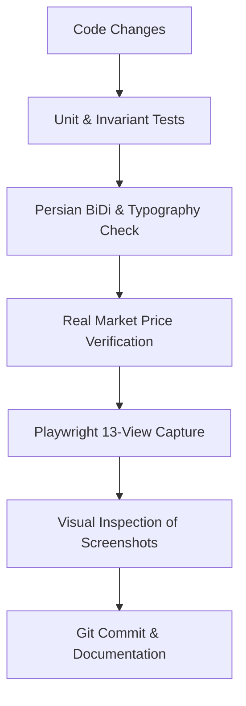

# QUALITY_GATE.md — Pre-Flight Checklist & Verification Protocols

This document defines the strict validation steps required before declaring any feature or bugfix complete.



## Step 1: Automated Unit Tests & Invariant Verification
```bash
pytest tests/ -v
```
All financial transformations (drawdown calculations, transaction fee splits, BiDi string isolations, indicator math) must pass.

## Step 2: Font & Offline Assets Verification
1. Ensure all font files are served from `/fonts/` locally in `apps/web/public/fonts/`.
2. Inspect network tab / build output to ensure zero external requests to `fonts.googleapis.com` or `fonts.gstatic.com`.

## Step 3: Real Market Price Integrity
Ensure base prices in `packages/data_adapters/fixtures.py` and synced bars match real-world Tehran Stock Exchange levels:
- شبریز: ۴۳,۲۴۰ ریال
- فولاد: ۲,۷۸۵ ریال
- وبملت: ۱,۲۹۱ ریال
- وتجارت: ۷۷۴ ریال
- فزر: ۲۰۴,۳۰۰ ریال

## Step 4: Playwright Headless Verification
```bash
node scripts/capture_all_views.js
```
Review the 13 PNG images in `screenshots/` to verify zero visual overlap, no broken numbers, and flawless Persian RTL alignment.
