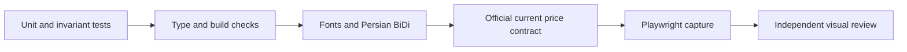

# Quality Gate — کنترل پیش از انتشار

هیچ تغییر مالی با یک تست واحد «کامل» محسوب نمی‌شود.



## ۱. تست و invariant

```powershell
py -3.11 -m pytest tests/ -q
node apps/web/node_modules/typescript/bin/tsc --noEmit -p apps/web/tsconfig.json
```

کارمزد، مالیات، cash ledger، next-snapshot fill، timestamp منبع، جلوگیری از look-ahead، کمپین فعال یکتا و گیت داده باید پوشش داشته باشند.

## ۲. فونت و BiDi

- دقیقاً ۱۰ فایل Vazirmatn باید از `apps/web/public/fonts/` محلی بارگذاری شوند.
- وابستگی به Google Fonts مجاز نیست.
- قیمت، درصد، تاریخ و پرانتز در RTL باید با LRM (`\u200E`) یا isolate معتبر رندر شوند.

## ۳. قیمت جاری

fixture یا عدد ثابت با «قیمت واقعی» مقایسه نمی‌شود. در زمان آزمون باید:

- receipt رسمی `HEALTHY` باشد؛
- timestamp منبع، واحد ریال و دامنه مجاز ثبت شود؛
- حداقل یک cross-check مستقل/مسیر انتقال ثانویه اختلاف قیمت را در tolerance مصوب بررسی کند؛
- داده stale یا اختلاف حل‌نشده، گیت معامله را ببندد.

اگر VPN/TLS دسترسی را قطع کند، این مرحله `BLOCKED` است و انتشار ادعای قیمت جاری ممنوع می‌ماند.

## ۴. مرورگر

```powershell
node scripts/capture_all_views.js
```

تمام viewها در desktop و موبایل بازبینی می‌شوند: empty/error/loading state، RTL، overflow، عدد ساختگی، provenance، دکمه‌های دارای اثر و احراز هویت.

## ۵. نتیجه

گزارش نهایی باید وضعیت هر گیت را `VALIDATED`، `PARTIAL` یا `BLOCKED` اعلام کند. نبود داده یا runtime قابل دسترسی با حدس جایگزین نمی‌شود.
